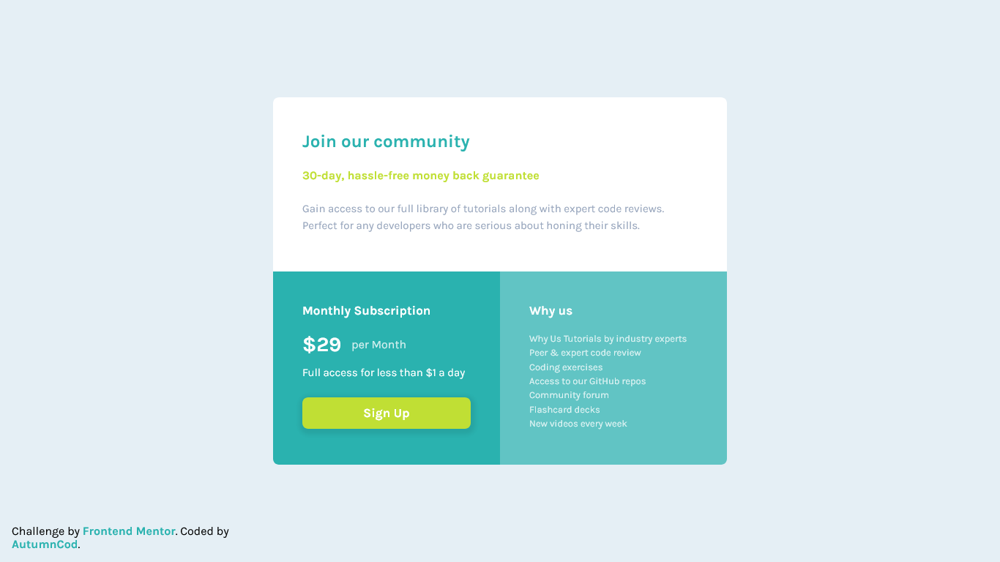

# Frontend Mentor - Single price grid component solution

This is a solution to the [Single price grid component challenge on Frontend Mentor](https://www.frontendmentor.io/challenges/single-price-grid-component-5ce41129d0ff452fec5abbbc). Frontend Mentor challenges help you improve your coding skills by building realistic projects.

## Table of contents

-  [Overview](#overview)
   -  [The challenge](#the-challenge)
   -  [Screenshot](#screenshot)
   -  [Links](#links)
-  [My process](#my-process)
   -  [Built with](#built-with)
   -  [What I learned](#what-i-learned)
   -  [Continued development](#continued-development)
   -  [Useful resources](#useful-resources)
-  [Author](#author)
-  [Acknowledgments](#acknowledgments)

**Note: Delete this note and update the table of contents based on what sections you keep.**

## Overview

### The challenge

Users should be able to:

-  View the optimal layout for the component depending on their device's screen size
-  See a hover state on desktop for the Sign Up call-to-action

### Screenshot

### Links

-  Solution URL: [Solution](https://github.com/AutumnCod/frontent-projects/tree/main/newbie/single-price-grid)
-  Live Site URL: [Live Site](https://fervent-neumann-6feffa.netlify.app/)

## My process

### Built with

-  Semantic HTML5 markup
-  SCSS
-  CSS Grid
-  Mobile-first workflow
-  parcel

### What I learned

I used to work with grid and I had trouble with center the card and the in and out

### Continued development

-  grid
-  parcel

### Useful resources

-  [The Coder Coder](https://www.youtube.com/c/TheCoderCoder) - she helped me with the function
-  [Kevin Powell](https://www.youtube.com/kepowob) - he helped me to understand a little bit of grid

## Author

-  Website - [Github](https://github.com/AutumnCod)
-  Frontend Mentor - [@AutumnCod](https://www.frontendmentor.io/profile/AutumnCod)
-  Twitter - [@CodAutumn](https://twitter.com/CodAutumn)

## Acknowledgments

Kevin Powell, The Coder Code
**Note: Delete this note and edit this section's content as necessary. If you completed this challenge by yourself, feel free to delete this section entirely.**
